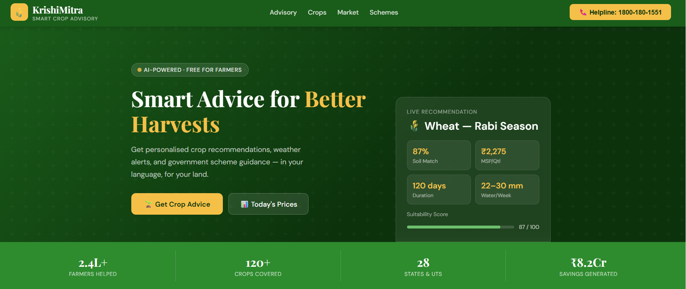
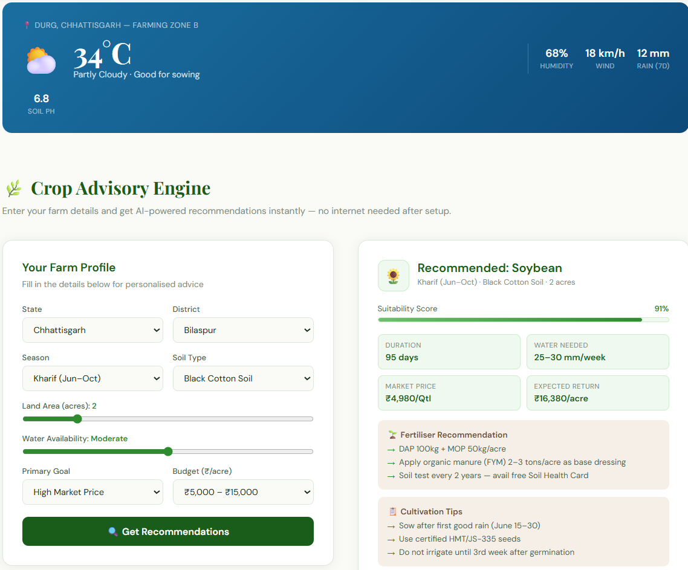
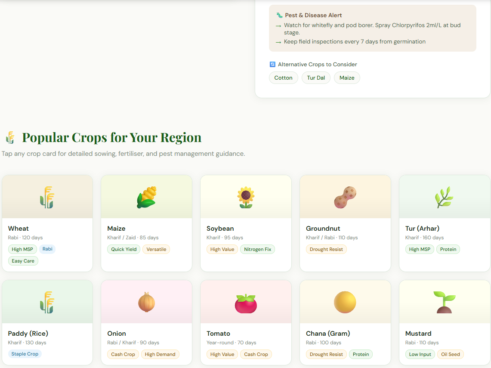
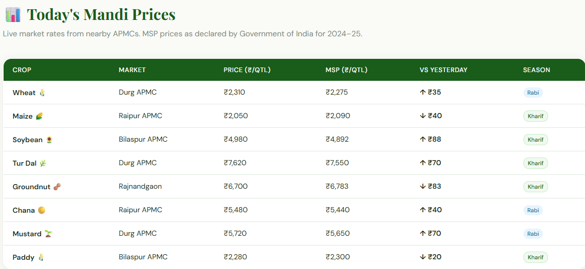
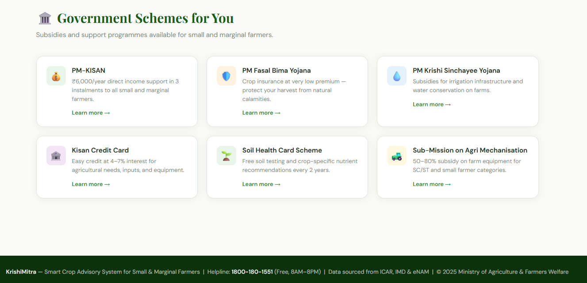

<div align="center">


# KrishiMitra — Smart Crop Advisory System

**AI-powered crop recommendations for small & marginal farmers across India**

[](https://your-demo-link.com)
[](LICENSE)
[](https://your-link.com)
[](https://your-link.com)
[](https://your-link.com)

<br/>

> *"Get personalised crop advice, weather alerts, and government scheme guidance — in your language, for your land."*

</div>

---

## 📸 Screenshots

### 🏠 Hero — Smart Crop Intelligence



> AI-powered recommendation card with live suitability score, MSP price, water requirements, and crop duration — visible right on the landing page.

---

### 🌿 Crop Advisory Engine



> Fill in your farm profile (state, soil type, season, budget, water availability) and instantly receive a personalised recommendation with fertiliser plans, cultivation tips, and expected returns.

---

### 🌾 Popular Crops for Your Region



> Browse 10+ crops with season, duration, and key attribute tags. Click any card to auto-fill the advisory form and get detailed sowing, fertiliser, and pest management guidance.

---

### 📊 Today's Mandi Prices



> Live market rates from nearby APMCs with MSP comparisons and daily price movement — updated for all major Kharif and Rabi crops.

---

### 🏛️ Government Schemes



> Quick-access cards for PM-KISAN, PM Fasal Bima Yojana, Kisan Credit Card, and more — with direct links to official portals.

---

## ✨ Features

| Feature | Description |
|---------|-------------|
| 🤖 **AI Advisory Engine** | Soil + season + goal → instant crop recommendation with score |
| 📊 **Live Mandi Prices** | Real-time prices from nearby APMCs with MSP comparison |
| 🌦️ **Weather Integration** | Hyperlocal weather strip with farming-relevant indicators |
| 🌾 **Crop Library** | 10+ crops with sowing, fertiliser & pest management guides |
| 🏛️ **Scheme Finder** | Curated government subsidy & insurance scheme cards |
| 📱 **Responsive Design** | Works on mobile, tablet, and desktop |
| 🌍 **Multi-region Support** | Covers 28 states & UTs with localised soil & crop data |
| ⚡ **No-install, No-login** | Pure HTML/CSS/JS — works offline after first load |

---

## 🚀 Quick Start

```bash
# Clone the repository
git clone https://github.com/your-username/krishimitra.git

# Navigate into the project
cd krishimitra

# Open in browser (no build step needed!)
open index.html
```

Or simply open `index.html` in any modern browser. No dependencies, no npm install, no build process.

---

## 🛠️ Tech Stack

```
Frontend   →  Vanilla HTML5 + CSS3 + JavaScript (ES6+)
Fonts      →  Playfair Display · DM Sans (Google Fonts)
Icons      →  Native Emoji (zero dependency)
Data       →  Static JSON-like JS objects (swappable for API)
Hosting    →  Any static host — GitHub Pages, Netlify, Vercel
```

---

## 📁 Project Structure

```
krishimitra/
├── index.html          # Single-file app (HTML + CSS + JS)
├── README.md           # You are here
├── screenshots/
│   ├── hero.png
│   ├── advisory.png
│   ├── crops.png
│   ├── market.png
│   └── schemes.png
└── LICENSE
```

---

## 🌱 How the Advisory Engine Works

```
User Input
    │
    ├─ State / District
    ├─ Season (Kharif / Rabi / Zaid)
    ├─ Soil Type
    ├─ Land Area
    ├─ Water Availability
    ├─ Primary Goal
    └─ Budget per Acre
         │
         ▼
  ADVICE_DB Lookup
  (season × soil matrix)
         │
         ▼
  Recommendation Output
    ├─ Crop + Suitability Score (%)
    ├─ Fertiliser Plan
    ├─ Cultivation Tips
    ├─ Pest & Disease Alerts
    ├─ Market Price + Expected Return
    └─ Alternative Crop Suggestions
```

---

## 🗺️ Supported Regions

| State | Districts Covered |
|-------|------------------|
| Chhattisgarh | Durg, Raipur, Bilaspur, Korba |
| Madhya Pradesh | Expanding |
| Maharashtra | Expanding |
| Punjab | Expanding |
| + 24 more states | Coming soon |

---

## 📈 Advisory Data Coverage

| Season | Soil Types | Crops Recommended |
|--------|-----------|------------------|
| Kharif (Jun–Oct) | Black Cotton, Red Loamy, Sandy Loam, Alluvial, Laterite | Soybean, Tur Dal, Maize, Paddy, Groundnut |
| Rabi (Nov–Mar) | All 5 soil types | Wheat, Mustard, Chickpea, Barley |
| Zaid (Mar–Jun) | Sandy Loam, Alluvial, Black Cotton, Red Loamy, Laterite | Maize, Moong, Watermelon, Sesame, Cowpea |

---

## 🤝 Contributing

Contributions are welcome! To help expand coverage:

1. **Fork** the repository
2. **Add crop data** in `ADVICE_DB` for new state/soil/season combinations
3. **Add market prices** in the `MARKET` array
4. **Submit a Pull Request** with your changes

```bash
git checkout -b feature/add-gujarat-crops
# Make your changes
git commit -m "Add Gujarat Kharif crop data for sandy loam"
git push origin feature/add-gujarat-crops
```

---

## 📞 Helpline & Support

> 📱 **1800-180-1551** — Free helpline, 8AM–8PM, Monday to Saturday  
> 📡 Data sourced from **ICAR**, **IMD**, and **eNAM**  
> 🏛️ Supported by **Ministry of Agriculture & Farmers Welfare**

---

## 📄 License

This project is licensed under the **MIT License** — see the [LICENSE](LICENSE) file for details.

---

<div align="center">

Made with 💚 for India's farmers

**⭐ Star this repo if KrishiMitra helped you!**

[](https://github.com/your-username/krishimitra)
[](https://github.com/your-username/krishimitra)

</div>
